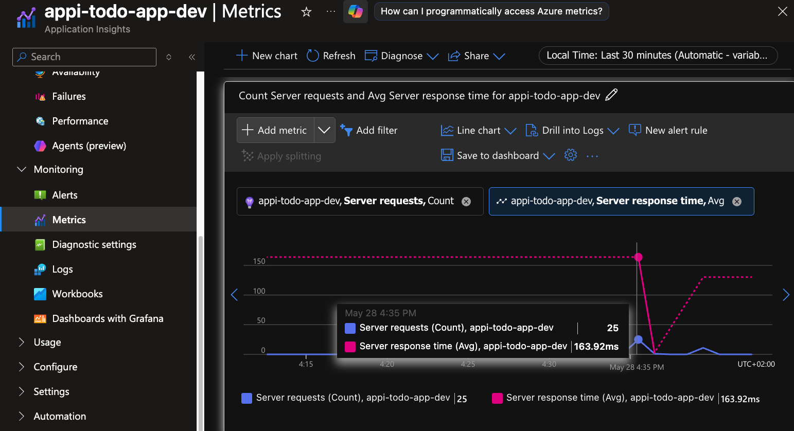

# 📝✅ "To-Do App" by Python, Fast API Postgre, React

[](https://www.python.org/)
[](https://fastapi.tiangolo.com/)
[](<[https://fastapi.tiangolo.com/](https://www.sqlalchemy.org/)>)
[](https://vitejs.dev/)
[](https://reactjs.org/)
[](https://www.typescriptlang.org/) <br>
[](<[https://vitejs.dev/](https://www.framer.com/motion/)>)
[](https://azure.microsoft.com/)
[](https://www.terraform.io/)
[](https://www.docker.com/)
[](https://nodejs.org/)
[](https://azure.microsoft.com/en-us/products/devops/)

I wrote a pipeline for a simple, three-tier application. I used Dockerhub as a free registry and an IaC tool (Terraform) to build the infrastructure.

Azure services I used:

**App Service** -> backend \
**Static Web App** -> frontend \
**Azure Database for PostgreSQL flexible servers** \
**Key Vault** -> for storing secrets \
**Azure DevOps** -> pipeline

The application is hosted at:

a) localhost:5173


b) https://icy-sand-0a2899f03.1.azurestaticapps.net (run the pipeline previously)

https://github.com/user-attachments/assets/438a9ccd-4fcc-49e0-aa9e-e6333c98b309

## ⚙️ Technology Stack

### Backend

- **Python** - one of the most promising programming languages for building API services, ranking 1st by [TIOBE](https://www.tiobe.com/tiobe-index/) and [Google Trends](https://trends.google.com/trends/explore?date=now%201-d&geo=RU&q=python,C,Java,JavaScript,Go&hl=en).
- **FastAPI** - a modern, fast, and high-performance web framework for building APIs with Python.
- **uvicorn** - an asynchronous server for running FastAPI applications.
- **PostgreSQL** - a popular relational database.
- **SQLAlchemy** - a Python library for database interaction, providing an abstraction layer between the code and the database.

### Frontend

- **React** - a popular JavaScript library for building user interfaces.
- **TypeScript** - a statically-typed superset of JavaScript.
- **Vite** - a modern build tool for creating and developing web applications with hot-reloading and more.

### Infra

- **Microsoft Azure Devops** - a comprehensive SaaS platform.
- **Terraform** - IaaC tool.

<br/>

## 🗄️ Database table `tasks`

| Column      | Type                        | Collation | Nullable | Default                           |
| ----------- | --------------------------- | --------- | -------- | --------------------------------- |
| `id`        | integer                     |           | not null | nextval('tasks_id_seq'::regclass) |
| `title`     | character varying           |           |          |                                   |
| `completed` | boolean                     |           |          |                                   |
| `createdAt` | timestamp without time zone |           |          | CURRENT_TIMESTAMP                 |

#### Indexes

- "tasks_pkey" PRIMARY KEY, btree (id)
- "ix_tasks_id" btree (id)
- "ix_tasks_title" btree (title)

<br/>

## ▶️ Running the Project

### Running the Backend

1.  Create database in [PostgreSQL](https://www.postgresql.org/) and make `.env` file in `backend` directory with your database connection constants:

    ```bash
    DB_HOST=localhost
    DB_USER=todo_user
    DB_PASSWORD=123
    DB_NAME=todo_db
    ```

    _This constants will be used in `models.py` file for connecting to database._<br>
    \*For making `.env` you can simply rename template `.env.example`

2.  Activate the Python virtual environment (if used):

    ```bash
    .\venv\Scripts\activate   # Windows
    source venv/bin/activate  # Unix/macOS
    ```

    _When you finish the development session, you can deactivate the virtual environment using the `deactivate` command in the terminal where the environment was activated. This will return you to the global Python environment._

3.  Start the server:
    ```bash
        uvicorn main:app --reload
    ```
    _The backend will be running and available at: http://127.0.0.1:8000/_

### Running the Frontend

1.  Install dependencies:

        npm install

2.  Start the local development server:

        npm run dev

    Or use the command for Vite::

        npx vite

    The frontend will be running and available at: http://127.0.0.1:5173

<br/>

<hr>

## Alternative way to start app

In the root of project directory run:

- Windows: start `start.ps1`

  ```
     .\start.ps1
  ```

- Linux:
  Make the script executable: `chmod +x start.sh` and then start:
  ```
     .\start.sh
  ```

### Docker Setup

1. Ensure Docker is installed on your system.

2. Build the backend image:

   ```bash
   docker build -f backend/Dockerfile -t todo-app-backend .
   ```

3. Build the frontend image:

   ```bash
   docker build -f frontend/Dockerfile -t todo-app-frontend .
   ```

4. Run the containers:

   ```bash
   docker run -p 8000:8000 --env-file backend/.env todo-app-backend
   docker run -p 5173:5173 todo-app-frontend
   ```

5. Access the application:
   - Backend API: http://localhost:8000
   - Frontend: http://localhost:5173

Alternatively, use Docker Compose for simplified orchestration by creating a `docker-compose.yml` file in the project root.

## 🚀 CI/CD Pipeline

This project uses **Azure Pipelines** for automated building and deployment:

### Build Stage

- Installs Docker on the build agent
- Builds the backend Docker image
- Pushes the image to Docker Hub with version tags

### Release Stage

- Deploys the frontend to Azure Static Web Apps
- Automatically triggers on pipeline completion

See `azure-pipelines.yml` for pipeline configuration details.

### Results

1. Application operations


2. Aplication monitoring



## License

This project is licensed under the MIT License - see the [LICENSE](LICENSE) file for details.
